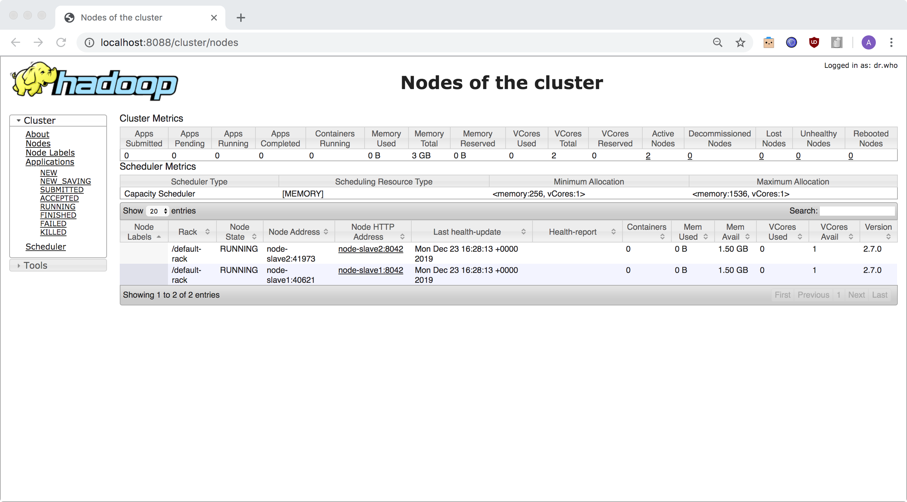

# Micro-Cluster Lab Using Docker, To Experiment With Spark on Yarn
The majority of the code is copied from the project related in [this article](https://lemaizi.com/blog/creating-your-own-micro-cluster-lab-using-docker-to-experiment-with-spark-dask-on-yarn/).
The original project contains snippets to install Dask and Zeppelin. This version though, focuses on installing Big Data processing tools (Spark, YARN, Hive, HDFS, ...).

### Project Folder Tree

```
├── docker-compose.yml
├── Dockerfile
├── confs
│   ├── config
│   ├── core-site.xml
│   ├── hdfs-site.xml
│   ├── mapred-site.xml
│   ├── requirements.req
│   ├── slaves
│   ├── spark-defaults.conf
│   └── yarn-site.xml
│   └── <more_config_files>
├── datasets
│   ├── alice_in_wonderland.txt
│   └── iris.csv
│   └── <more_datasets>
└── script_files
    └── bootstrap.sh
    └── <custom_code_scripts>
```


### Create the base container image

```bash
root@machine:${MINI_SPARK_CLUSTER_HOME}# docker build . -t cluster-base
```

### Run the cluster or micro-lab

```bash
root@machine:${MINI_SPARK_CLUSTER_HOME}# docker-compose up -d
```

### Reset the environment
We created a script in order to completely reset the environment with the script's execution:
```bash
root@machine:${MINI_SPARK_CLUSTER_HOME}# ./${MINI_SPARK_CLUSTER_HOME}/reset_environment.sh
```

### Yarn resource manager UI

Access the Yarn resource manager UI using the following link : http://localhost:8088/cluster/nodes



### Stopping the micro-lab

```
docker-compose down
```

##### COMMENTS #####
- For some reason, USING DERBY there are 2 different metastores:
	- Spark metastore: this is created when using some feature of Spark SQL like creating tables, databases, etc. It will create a derby.log and a metastore directory in "/opt/spark"
	- Hive metastore: when initiating the schema, it creates a "metastore_db" directory under the master's "/" path. In that path we can also find a "/derby.log" file.

The thing is that both store the info in HDFS under "/user/hive/warehouse". 
They however cannot see each other's databases/tables. E.g. Spark cannot see Hive's tables and viceversa; and we cannot access Spark created tables using beeline.
We might want to try forcing Spark on using Hive's native metastore instead of creating its own. Thus, we could even read Spark generated tables using Hive and viceversa..

- The solution comes with using MySQL as the metastore. This way, MySQL externalizes the database.

